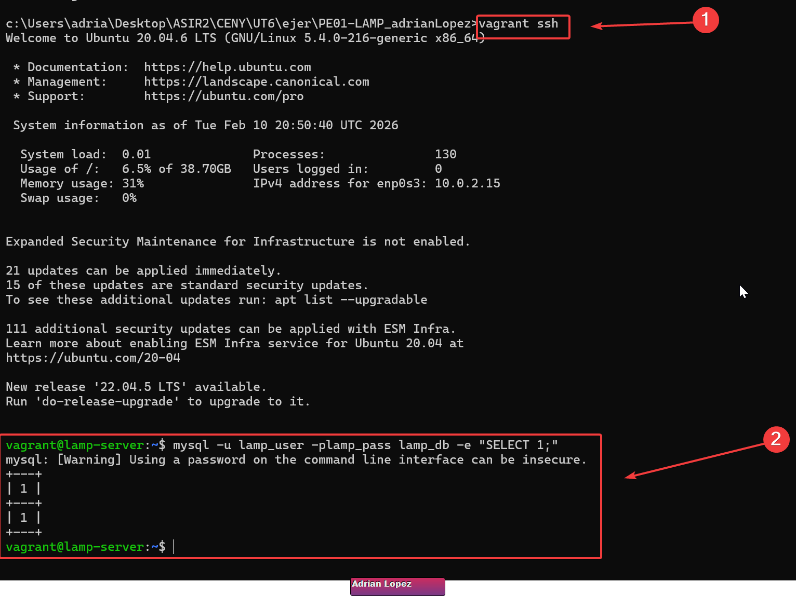
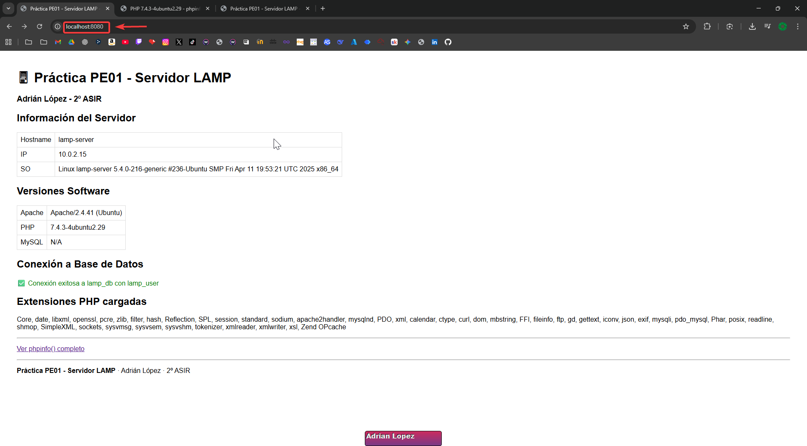
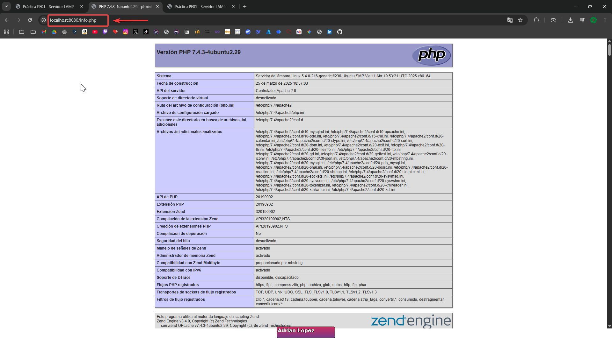
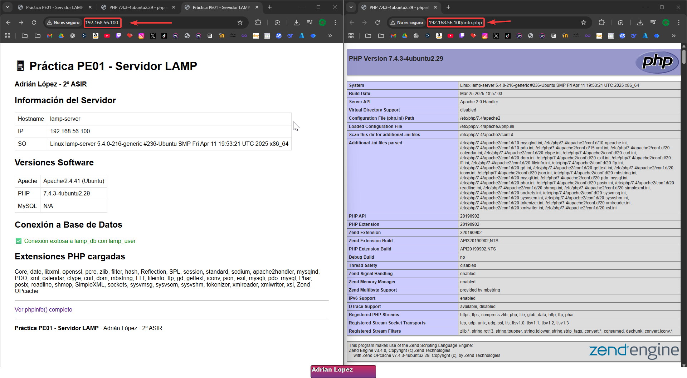

# PE01 - Servidor LAMP con Vagrant

Práctica realizada por **Adrián López**, estudiante de **2º ASIR**.

Servidor LAMP (Linux + Apache + MySQL + PHP) completamente automatizado con Vagrant.

## Descripción

Este proyecto levanta una máquina virtual Ubuntu 20.04 (box `ubuntu/focal64`) con:

- Apache 2.4
- MySQL 8.0
- PHP 7.4+ y extensiones básicas (`php-mysql`, `php-curl`, `php-gd`, `php-mbstring`, `php-xml`)

Incluye una aplicación PHP de prueba que:

- Muestra información del servidor (hostname, IP, SO)
- Muestra las versiones instaladas de Apache, PHP y MySQL
- Comprueba la conexión a la base de datos `lamp_db` con el usuario `lamp_user`
- Lista las extensiones PHP cargadas

## Requisitos previos

- VirtualBox 7.0 o superior
- Vagrant 2.4 o superior
- Al menos 2 GB de RAM libres
- Al menos 5 GB de espacio en disco

## Estructura del proyecto

- `Vagrantfile`: configuración de la máquina virtual y provisioning
- `scripts/`: scripts de instalación y configuración del stack LAMP
- `www/`: contenido web servido por Apache

## Uso

Clona o copia el proyecto y levanta la máquina virtual:

```bash
cd PE01-LAMP_adrianLopez
vagrant up
```

Para apagar la máquina:

```bash
vagrant halt
```

Para destruirla (y comprobar reproducibilidad):

```bash
vagrant destroy -f
vagrant up
```

## Acceso

- **Web (host → VM)**: `http://localhost:8080`
- **IP privada VM**: `http://192.168.56.100`
- **SSH a la VM**: `vagrant ssh`

## Base de datos

- **Nombre BD**: `lamp_db`
- **Usuario**: `lamp_user`
- **Password**: `lamp_pass`
- **Permisos**: ALL PRIVILEGES en `lamp_db.*`

Prueba rápida desde la VM:

```bash
vagrant ssh
mysql -u lamp_user -plamp_pass lamp_db -e "SELECT 1;"
```



## Capturas de pantalla




Acceso por IP




## Autor

- Nombre: **Adrián López**
- Ciclo: **Administración de Sistemas Informáticos en Red (2º ASIR)**