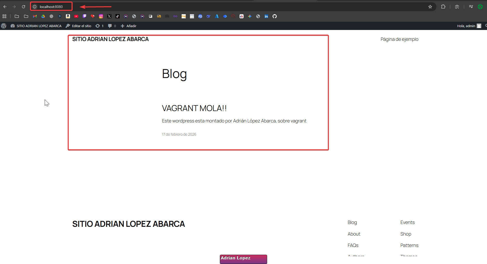

 # PE02 - Infraestructura WordPress Multi-máquina

## Descripción general

Este proyecto despliega, mediante Vagrant y VirtualBox, una infraestructura WordPress profesional con **dos máquinas virtuales separadas**:

- **web-server**: servidor web con Apache y PHP donde se aloja WordPress.
- **db-server**: servidor de base de datos MySQL accesible desde la red privada.

Toda la infraestructura se provisiona de forma **automática mediante scripts** de shell, sin intervención manual dentro de las VMs.

## Arquitectura

- **Red privada**: `192.168.56.0/24`
  - `web-server` → `192.168.56.10`
  - `db-server` → `192.168.56.20`
- **Port forwarding**:
  - Host `localhost:8080` → `web-server:80`
- **Servicios**:
  - `web-server`:
    - Apache 2.4
    - PHP 7.4+ con extensiones necesarias para WordPress
    - WordPress (última versión estable descargada desde wordpress.org)
  - `db-server`:
    - MySQL 8.0
    - Base de datos `wordpress_db`
    - Usuario `wp_user` con acceso solo desde la red privada `192.168.56.%`

Diagrama lógico (texto):

- Host
  - Vagrant + VirtualBox
  - Puerto `8080` redirigido al puerto `80` de `web-server`
- Red privada `192.168.56.0/24`
  - `web-server (192.168.56.10)` ←→ `db-server (192.168.56.20)` por TCP/3306

## Estructura del proyecto

```text
PE02-wordpress_adrianLopez/
├── Vagrantfile
├── README.md
├── scripts/
│   ├── common.sh
│   ├── install-web.sh
│   ├── install-db.sh
│   └── configure-wordpress.sh
└── config/
    └── wordpress.conf
```

### `Vagrantfile`

- Define dos VMs:
  - `db` (`db-server`, IP `192.168.56.20`, 2048 MB RAM)
  - `web` (`web-server`, IP `192.168.56.10`, 1024 MB RAM, puerto 80 → 8080)
- Provisiona cada VM con los scripts correspondientes:
  - `db`:
    - `scripts/common.sh`
    - `scripts/install-db.sh`
  - `web`:
    - `scripts/common.sh`
    - `scripts/install-web.sh`
    - `scripts/configure-wordpress.sh` (recibe variables de entorno para la BD).

### `scripts/common.sh`

- Actualiza el sistema.
- Instala utilidades básicas (`vim`, `curl`, `wget`, `net-tools`, `mysql-client`).
- Configura `/etc/hosts` en ambas VMs para resolución de nombres:
  - Añade **cada entrada de forma independiente e idempotente** (comprueba si ya existe antes de añadir), de modo que tanto `web-server` como `db-server` resuelvan correctamente desde cualquier VM.
  - `192.168.56.10 web-server`
  - `192.168.56.20 db-server`
- Configura la zona horaria a `Europe/Madrid`.

### `scripts/install-db.sh`

- Instala **MySQL Server**.
- Configura MySQL para aceptar conexiones remotas:
  - Sustituye cualquier línea `bind-address` en `mysqld.cnf` por `bind-address = 0.0.0.0` (compatible con espacios/indentación del fichero), de modo que MySQL escuche en todas las interfaces y acepte conexiones desde la red privada.
- Crea la base de datos y usuario:
  - BD: `wordpress_db` (charset `utf8mb4`, collation `utf8mb4_unicode_ci`).
  - Usuario: `wp_user`@`192.168.56.%` con contraseña `wp_secure_pass`.
- Concede todos los privilegios sobre `wordpress_db` a `wp_user`.
- Aumenta la seguridad:
  - Elimina posibles accesos remotos del usuario `root` (solo se mantiene local).
- Muestra listado de BDs y usuarios para verificación.

### `scripts/install-web.sh`

- Instala Apache 2.4.
- Instala PHP 7.4+ y todas las extensiones recomendadas para WordPress:
  - `php-mysql`, `php-curl`, `php-gd`, `php-mbstring`, `php-xml`,
    `php-xmlrpc`, `php-zip`, `php-intl`, `php-opcache`, etc.
- Habilita módulos necesarios en Apache (por ejemplo `rewrite`).
- Descarga la última versión de WordPress desde `wordpress.org`.
- Copia los archivos de WordPress a `/var/www/html`.
- Configura permisos correctos:
  - Propietario: `www-data:www-data`.
  - Directorios `755`, ficheros `644`.
- Configura el VirtualHost de Apache:
  - Intenta usar `config/wordpress.conf` (copiado a `/etc/apache2/sites-available/wordpress.conf`).
  - Si no existe, genera una configuración por defecto equivalente.
- Deshabilita el sitio por defecto (`000-default.conf`) y habilita `wordpress.conf`.
- Reinicia Apache.

### `scripts/configure-wordpress.sh`

- Parte de `/var/www/html`.
- Crea `wp-config.php` a partir de `wp-config-sample.php` si no existe.
- Usa las variables de entorno proporcionadas por Vagrant:
  - `DB_HOST`, `DB_NAME`, `DB_USER`, `DB_PASS`.
- Configura los datos de conexión de WordPress a la BD remota (MySQL en `db-server`).
- Descarga y añade **claves SALT** seguras desde la API oficial de WordPress.
- Añade configuración adicional:
  - `WP_DEBUG` desactivado.
  - Desactiva actualizaciones automáticas del core.
  - Desactiva el editor de ficheros desde el panel (`DISALLOW_FILE_EDIT`).
  - Define `WP_SITEURL` y `WP_HOME` apuntando a `http://192.168.56.10`.
- Verifica la conexión a la base de datos mediante un script PHP que abre un `PDO` hacia MySQL.
- Ajusta permisos finales de `wp-config.php` (`www-data:www-data`).

### `config/wordpress.conf`

VirtualHost de Apache preparado para WordPress:

- `DocumentRoot /var/www/html`.
- `AllowOverride All` para permitir `.htaccess` de WordPress.
- Logs específicos:
  - `wordpress_error.log`
  - `wordpress_access.log`

## Puesta en marcha

### 1. Requisitos previos en el host

- Vagrant instalado.
- VirtualBox (u otro proveedor compatible con Vagrantfile).

### 2. Levantar la infraestructura

Desde la carpeta `PE02-wordpress_adrianLopez`:

```bash
vagrant up
```

Esto:

- Creará la VM `db` (MySQL) y la configurará.
- Creará la VM `web` (Apache + PHP + WordPress) y la configurará.

**Si ya tienes las VMs levantadas** y has actualizado los scripts (por ejemplo tras correcciones), puedes volver a ejecutar solo el provisioning sin destruir las máquinas:

```bash
vagrant provision db
vagrant provision web
```

### 3. Verificar estado de las VMs

```bash
vagrant status
```

Deberías ver ambas VMs en estado `running`.

### 4. Verificar conectividad entre VMs

```bash
vagrant ssh web -c "ping -c 3 192.168.56.20"
vagrant ssh web -c "ping -c 3 db-server"
```

### 5. Verificar MySQL desde `web-server`

```bash
vagrant ssh web -c "mysql -h 192.168.56.20 -u wp_user -pwp_secure_pass -e 'SHOW DATABASES;'"
```

Debes ver la base de datos `wordpress_db` en el listado.

### 6. Acceder a WordPress desde el navegador

En el host, abre:

- `http://localhost:8080`

Debería aparecer el instalador inicial de WordPress.

Completa los datos:

- **Título del sitio**: a tu elección.
- **Usuario admin**: por ejemplo `admin`.
- **Contraseña**: una contraseña segura.
- **Email**: tu correo (puede ser ficticio para pruebas).

Después podrás acceder al panel de administración:

- `http://localhost:8080/wp-admin`

## Credenciales y parámetros importantes

- **Base de datos**:
  - Nombre: `wordpress_db`
  - Usuario: `wp_user`
  - Password: `wp_secure_pass`
  - Host (desde `web-server`): `192.168.56.20` o `db-server`
- **Acceso web**:
  - Navegador (host): `http://localhost:8080`
  - Directo a la IP privada (si procede): `http://192.168.56.10`

## Pruebas recomendadas

1. **Infraestructura**:
   - `vagrant up`
   - `vagrant status`
2. **Red**:
   - Ping entre VMs como se indica arriba.
3. **MySQL**:
   - Comprobar conexión con `mysql` desde `web-server`.
4. **WordPress**:
   - Acceder al instalador.
   - Completar instalación.
   - Acceder al panel `/wp-admin`.
5. **Permisos**:
   - `vagrant ssh web` y comprobar:
     - `ls -ld /var/www/html` → propietario `www-data`.
     - `ls -l /var/www/html/wp-config.php` → propietario `www-data`.

## Troubleshooting básico

- **MySQL rechaza conexiones remotas**:
  - En `db-server`:
    - `sudo mysql -e "SELECT User, Host FROM mysql.user WHERE User='wp_user';"`
    - `sudo netstat -tlnp | grep 3306`
    - `sudo tail -f /var/log/mysql/error.log`
- **WordPress no conecta a la BD**:
  - En `web-server`:
    - `cat /var/www/html/wp-config.php | grep DB_`
    - `php -r "new PDO('mysql:host=192.168.56.20;dbname=wordpress_db', 'wp_user', 'wp_secure_pass');"`

## Capturas de pantalla

- **Aqui muestro que wordpress esta corriento correctamente despues de la instalación**:
  
  

